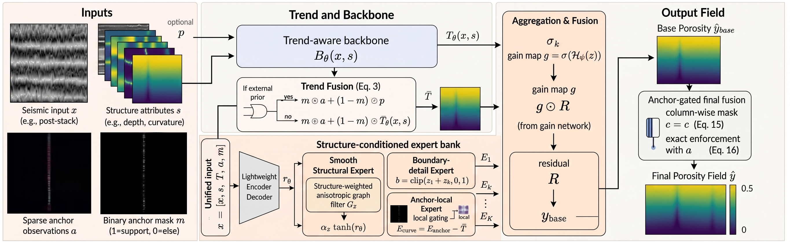
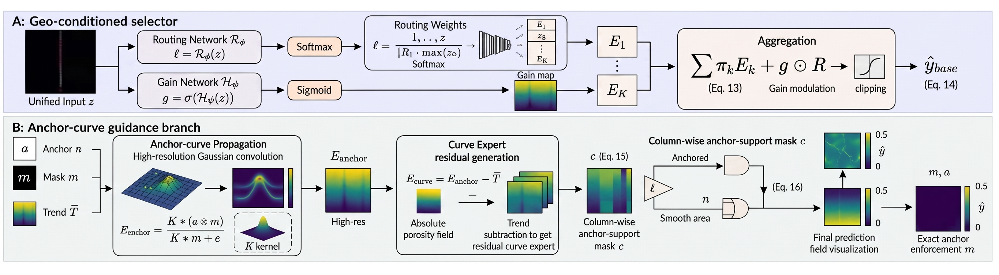
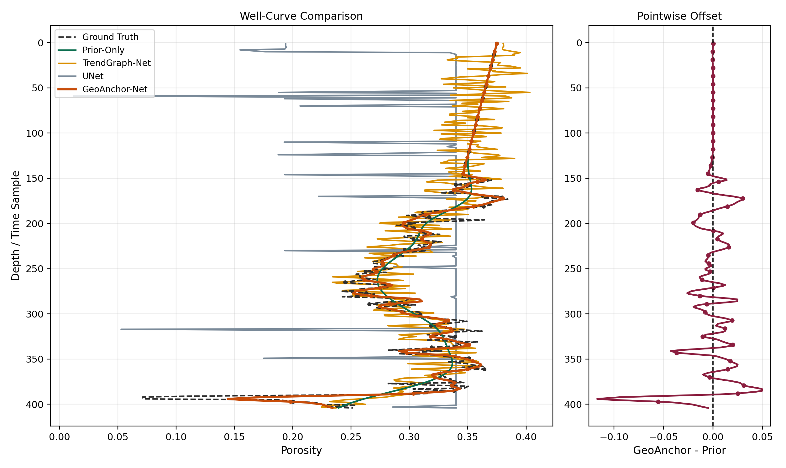
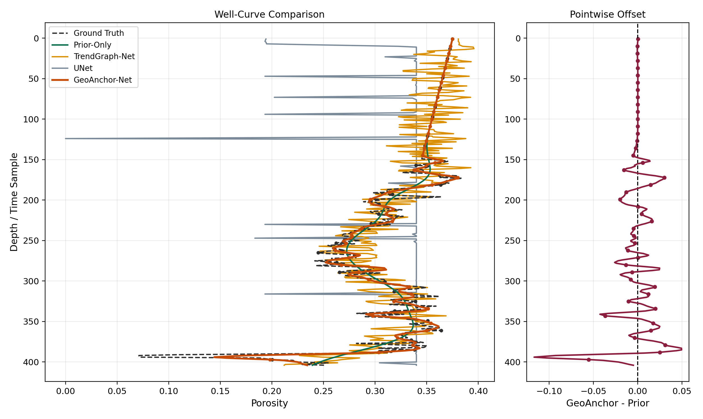
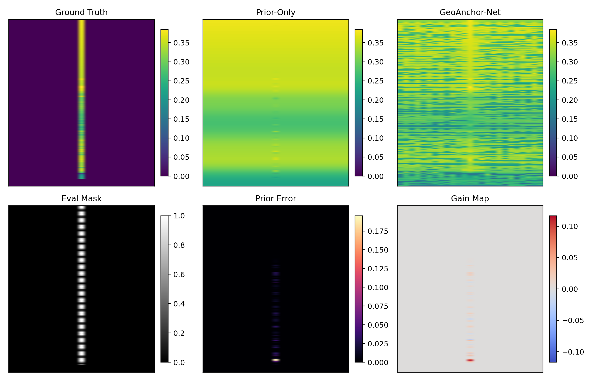
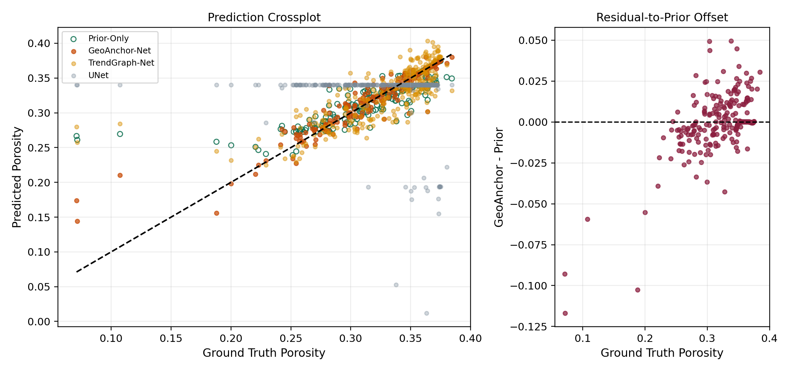

# GeoAnchor-Net

[中文说明](README_CN.md)

GeoAnchor-Net is a supervision-aware porosity prediction model for seismic-driven full-field reconstruction and sparse-well blind-interval prediction. The model combines geological trend construction, structure-conditioned residual allocation, and absolute porosity anchor propagation in one training and inference pipeline.

This repository contains the complete training and evaluation code for GeoAnchor-Net.

## Network Overview



Figure 1 shows the overall GeoAnchor-Net workflow. The model takes seismic input, structural attributes, an optional prior field, sparse porosity anchors, and an anchor mask. A trend branch first builds a stable background porosity field. The residual branch then predicts structure-conditioned correction components. The anchor branch propagates sparse well observations as absolute porosity values before the final anchor-consistent fusion.



Figure 2 highlights the two main modules used by the final model. The structure-conditioned weighting branch assigns residual components to different geological contexts, such as smooth regions, structural transitions, and well-supported intervals. The anchor-guidance branch keeps sparse well samples in the same physical variable as the target porosity, which avoids treating well observations only as residual perturbations to a prior.

## Experimental Examples




Figure 6 shows representative blind-interval well-curve comparisons on F3 Demo 2023. GeoAnchor-Net is compared with prior-based and learned alternatives along held-out depth intervals. The curve plots show whether sparse anchor information improves the local porosity trajectory rather than only reducing an image-level error.




Figure 7 shows local-window analyses on F3. The panels compare the ground truth, the prior-only prediction, the GeoAnchor-Net prediction, the evaluation mask, and the local error reduction. Warm regions in the gain maps indicate positions where GeoAnchor-Net reduces the local error relative to the prior-only result.



Figure 8 shows the F3 crossplot between predicted and reference porosity values on evaluation points. A tighter distribution around the identity line indicates better agreement with the held-out blind-interval samples.

## Repository Contents

```text
GeoAnchor_code/
  geoanchor/
    data.py          # NPZ dataset loader
    metrics.py       # regression metrics
    model.py         # GeoAnchor-Net
    train_eval.py    # training, validation calibration, and testing
  fig/
    fig1.pdf
    fig1.png
    fig2.pdf
    fig2.png
    fig6a.pdf
    fig6a.png
    fig6b.pdf
    fig6b.png
    fig7a.pdf
    fig7a.png
    fig7b.pdf
    fig7b.png
    fig8.pdf
    fig8.png
  train.py           # train one dataset
  test.py            # evaluate one checkpoint
  run_reproduce.py   # reproduce the four GeoAnchor-Net runs
  requirements.txt
```

## Data

Place the datasets under `GeoAnchor_code/data/` with the following layout:

```text
data/
  openporobench_s/
    train.npz
    val.npz
    test.npz
  external/
    f3_demo_2023/
      openporo_npz/
        train.npz
        val.npz
        test.npz
    seis2rock_dense_openporo/
      train.npz
      val.npz
      test.npz
    seis2rock_aux_openporo/
      train.npz
      val.npz
      test.npz
```

Dataset sources:

- F3 Demo 2023: https://terranubis.com/datainfo/F3-Demo-2023
- Seis2Rock-Smeaheia: https://zenodo.org/records/11481946
- OpenPoroBench-S: processed split released with this repository

Each `.npz` split should contain:

- `seismic`: shape `(N, 1, H, W)`
- `structure`: shape `(N, C, H, W)`
- `porosity`: shape `(N, 1, H, W)`
- `domains`: shape `(N,)`

Optional fields:

- `prior`: shape `(N, 1, H, W)`
- `supervised_mask`: observed sparse-well samples, shape `(N, 1, H, W)`
- `eval_mask`: held-out evaluation samples, shape `(N, 1, H, W)`

If `prior` is absent, the code builds a simple RGT-to-porosity trend prior from the training split using `structure[:, 0]`.

## Environment

```bash
conda activate yolo
cd GeoAnchor_code
pip install -r requirements.txt
```

The scripts use CUDA when available. If CUDA is not available, use `--device cpu`. For GPU runs, install the PyTorch build that matches the local CUDA driver. The code was checked with `torch==2.11.0+cu128`, `numpy==1.26.4`, and `scikit-image==0.26.0`.

## Train

OpenPoroBench-S:

```bash
python train.py \
  --data-root data/openporobench_s \
  --out-dir outputs/openporobench_s \
  --epochs 44 \
  --batch-size 8 \
  --lr 1.2e-4 \
  --seed 20260446 \
  --calibration-mode quadratic_prior \
  --disable-prior-condition \
  --anchor-band-strength 0.65 \
  --curve-gate-strength 0.65
```

F3 Demo 2023:

```bash
python train.py \
  --data-root data/external/f3_demo_2023/openporo_npz \
  --out-dir outputs/f3_demo_2023 \
  --epochs 20 \
  --batch-size 2 \
  --lr 7e-4 \
  --seed 20260431 \
  --calibration-mode none
```

Seis2Rock dense split:

```bash
python train.py \
  --data-root data/external/seis2rock_dense_openporo \
  --out-dir outputs/seis2rock_dense \
  --epochs 26 \
  --batch-size 4 \
  --lr 3e-4 \
  --seed 20260547 \
  --calibration-mode cubic_prior_relative \
  --disable-prior-condition \
  --anchor-band-strength 0.65 \
  --curve-gate-strength 0.65
```

Seis2Rock auxiliary split:

```bash
python train.py \
  --data-root data/external/seis2rock_aux_openporo \
  --out-dir outputs/seis2rock_aux \
  --epochs 24 \
  --batch-size 4 \
  --lr 2e-4 \
  --seed 20260727 \
  --calibration-mode cubic_prior_relative
```

## Test

```bash
python test.py \
  --checkpoint outputs/f3_demo_2023/geoanchor_net.pt \
  --data-root data/external/f3_demo_2023/openporo_npz \
  --out-dir outputs/f3_demo_2023_test
```

The test output contains:

- `test_metrics.json`
- `test_predictions.npz`

## Reproduce the Reported GeoAnchor-Net Runs

```bash
python run_reproduce.py
```

The summary is written to:

```text
outputs/reproduction_summary.json
```
